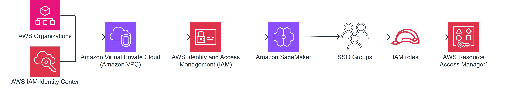

# Building a SageMaker Unified Studio Domain with AWS CDK

## Overview

[Amazon SageMaker Unified Studio](https://aws.amazon.com/sagemaker/unified-studio/) provides organizations with a unified development experience for data, analytics, AI, and machine learning services. However, in highly regulated industries such as financial services, healthcare, and government sectors, implementing such solutions requires a programmatic approach that ensures strict governance, audit trails, and consistent deployment practices.

## Solution Architecture

This guide follows a structured approach to implementing a SageMaker Unified Studio Domain using AWS CDK. Here are the key steps we'll cover:



### 1. Prerequisites (Environment Preparation)

* Set up AWS Organizations and AWS IAM Identity Center
* Configure VPC with private and public subnets

### 2. Security Hardening

* Implement IAM roles (execution roles, service roles)
* Set up permissions for Bedrock and other services
* Create domain execution and service roles with specific trust policies

### 3. Core Infrastructure Deployment

* Deploy Amazon SageMaker in the prepared VPC environment
* Configure network security and access controls
* Use CDK stack to provision DataZone domain with IAM roles

### 4. User Management

* Integrate with SSO for user authentication
* Set up domain ownership and audit trail capabilities
* Manage SSO users, IAM roles, and SSO groups through automated scripts

### 5. Role Management

* Create and configure specialized IAM roles for different functions
* Manage access permissions across the platform
* Associate domain roles for proper access control

### 6. Enabling Compute and Resources

* Set up project profiles and blueprints
* Create resource permissions and tooling for different user types

## Setup

### CDK Bootstrap

```bash
cdk bootstrap
```

### Virtual Environment Setup

To manually create a virtualenv on MacOS and Linux:

```bash
python3 -m venv .venv
```

After the init process completes and the virtualenv is created, activate your virtualenv:

```bash
source .venv/bin/activate
```

If you are on Windows platform:

```cmd
.venv\Scripts\activate.bat
```

Once the virtualenv is activated, install the required dependencies:

```bash
pip install -r requirements.txt
```

Synthesize the CloudFormation template:

```bash
cdk synth
```
Deploy the CloudFormation template:

```bash
cdk deploy
```

## Configuration

Update `metadata.json` and `usermgmt.json` before deploying the solution.

### metadata.json

```json
{
  "domain_name": "sagemaker-unified-studio",
  "sso": {
    "type": "IAM_IDC",
    "user_assignment": "MANUAL"
  },
  "blueprint_region": "<aws-region>",
  "blueprint_identifiers": [],
  "account_association": [
    {
      "target_account_id": "<associated-account-id>",
      "permissions": "arn:aws:ram::aws:permission/AWSRAMPermissionsAmazonDatazoneDomainExtendedServiceAccess",
      "resource_share_name": "<resource-share-name>",
      "domain_arn": "arn:aws:datazone:<aws-region>:<domain-account-id>:domain/<datazone-domain-id>"
    }
  ],
  "tags": {
    "Environment": "dev",
    "Service": "sagemaker unified studio"
  }
}
```

**Configuration Notes:**
- `blueprint_region`: AWS Region where resources will be deployed
- `target_account_id`: AWS Account ID that needs to be associated
- `resource_share_name`: Name for the resource share
- `domain_arn`: Complete ARN with domain account ID and DataZone domain ID (dzd_xxxxxxx)

### usermgmt.json

```json
{
  "domain_name": "sagemaker-unified-studio",
  "domain_arn": "arn:aws:datazone:<aws-region>:<domain-account-id>:domain/<datazone-domain-id>",
  "sso_users": [
    {
      "username": "example1@anycompany.com"
    }
  ],
  "sso_groups": [
    {
      "groupname": "Consumer"
    }
  ],
  "root_domain_owners": [
    {
      "role_arn": "arn:aws:iam::<domain-account-id>:role/<role-name>"
    },
    {
      "username": "example1@anycompany.com"
    },
    {
      "groupname": "Consumer"
    }
  ]
}
```

**Configuration Notes:**
- `sso_users`: SSO users to be added to the domain
- `sso_groups`: SSO groups for user management
- `root_domain_owners`: IAM roles and users who will have root domain ownership

## Useful Commands

* `cdk ls` - list all stacks in the app
* `cdk synth` - emits the synthesized CloudFormation template
* `cdk deploy` - deploy this stack to your default AWS account/region
* `cdk diff` - compare deployed stack with current state
* `cdk docs` - open CDK documentation

## Troubleshooting

### Common error while adding a domain unit owner other than default CDK role

```
WARNING:__main__:Failed to assume DataZone admin role: An error occurred (AccessDenied) when calling the AssumeRole operation:
User: arn:aws:sts::<domain-account-id>:assumed-role/Admin/sample-role is not authorized to perform: sts:AssumeRole on
resource: arn:aws:iam::<domain-account-id>:role/cdk-hnb659fds-cfn-exec-role-<domain-account-id>-<aws-region>. Using default credentials.
```

**Solution:** Update the CDK execution role's assume role policy:

```bash
aws iam update-assume-role-policy --role-name cdk-hnb659fds-cfn-exec-role-<domain-account-id>-<aws-region> --policy-document '{
  "Version": "2012-10-17",
  "Statement": [
    {
      "Effect": "Allow",
      "Principal": {
        "Service": "cloudformation.amazonaws.com"
      },
      "Action": "sts:AssumeRole"
    },
    {
      "Effect": "Allow",
      "Principal": {
        "AWS": "arn:aws:iam::<domain-account-id>:role/Admin"
      },
      "Action": "sts:AssumeRole"
    }
  ]
}'
```